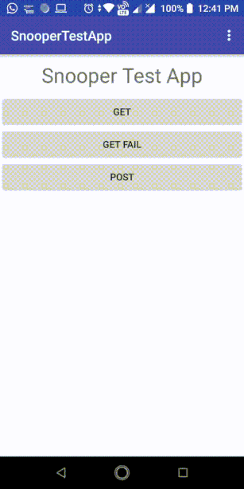

# Android Snooper

[](https://travis-ci.org/jainsahab/AndroidSnooper)

## Introduction
Android Snooper is a HTTP inspector which observes all the HTTP calls made by the app and opens up an Activity to see the detailed history of HTTP calls on `onShake` event. This library is inspired by the `Network Request History` feature of [FLEX](https://github.com/Flipboard/FLEX) app for iOS.



Android Snooper works on the interceptor mechanism provided by almost every HTTP client. All you need to do is initialize Android Snooper using `AndroidSnooper.init(this);` statement in your Application class and set an instance of `SnooperInterceptor` to the list of your network interceptors.
As of now we are providing the interceptors for the below libraries.

* [Spring Android Rest Template](http://projects.spring.io/spring-android/)

Didn't get your HTTP client's name in the list? No worries, You can still write your own implementation by using `Android Snooper's` core module and let Android Snooper know about the request being made. Below is given a dummy implementation.
```java
    AndroidSnooper androidSnooper = AndroidSnooper.getInstance();
    HttpCall httpCall = new HttpCall.Builder()
      .withUrl(httpRequest.getUrl())
      .withPayload(httpRequest.getRequestPayload())
      .withMethod(httpRequest.getMethod())
      .withResponseBody(httpResponse.getResponseBody())
      .withStatusCode(httpResponse.getRawStatusCode())
      .withStatusText(httpResponse.getStatusCode())
      .withRequestHeaders(httpRequest.getHeaders())
      .withResponseHeaders(httpResponse.getHeaders())
      .build();
    androidSnooper.record(httpCall);
```
The above implementation ought to be part of your custom interceptor where you will have access to the required `Request` and `Response` object to jot down the required data for Android Snooper to work properly.

**Warning:** As Android Snooper records each and every HTTP call goes through it. Please be cautious as it will record the sensitive information such as **Auth Tokens**, **Headers** etc. The only purpose of this library is *Debugging*. Hence, Debug or QA builds are the **only** perfect candidate for this library.

## Installation
```groovy
    repositories {
        mavenCentral()
    }

    // when using Android Snooper's core module
    compile ('com.github.jainsahab:Snooper:1.0.0@aar'){
      transitive = true
    }

    // Android Snooper library for "Spring Android Rest Template"
    compile ('com.github.jainsahab:Snooper-Spring:1.0.0@aar'){
      transitive = true
    }
```
Snapshot versions are available in [Sonatype's snapshots repository](https://oss.sonatype.org/content/repositories/snapshots).

# Attributions
This library uses:
* Icons made by [Madebyoliver](http://www.flaticon.com/authors/madebyoliver), [Freepik](http://www.freepik.com) and [Gregor Cresnar](http://www.flaticon.com/authors/gregor-cresnar) from [www.flaticon.com](http://www.flaticon.com) is licensed by <a href="http://creativecommons.org/licenses/by/3.0/" title="Creative Commons BY 3.0" target="_blank">CC 3.0 BY</a>.
* [StickyListHeaders](https://github.com/emilsjolander/StickyListHeaders) Android library by [emilsjolander](https://github.com/emilsjolander).


LICENSE
-------

```LICENSE
Copyright (C) 2017 Prateek Jain

Licensed under the Apache License, Version 2.0 (the "License");
you may not use this file except in compliance with the License.
You may obtain a copy of the License at

   http://www.apache.org/licenses/LICENSE-2.0

Unless required by applicable law or agreed to in writing, software
distributed under the License is distributed on an "AS IS" BASIS,
WITHOUT WARRANTIES OR CONDITIONS OF ANY KIND, either express or implied.
See the License for the specific language governing permissions and
limitations under the License.
```